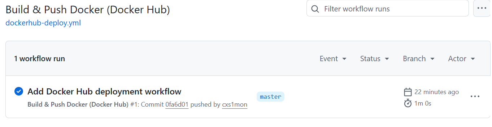
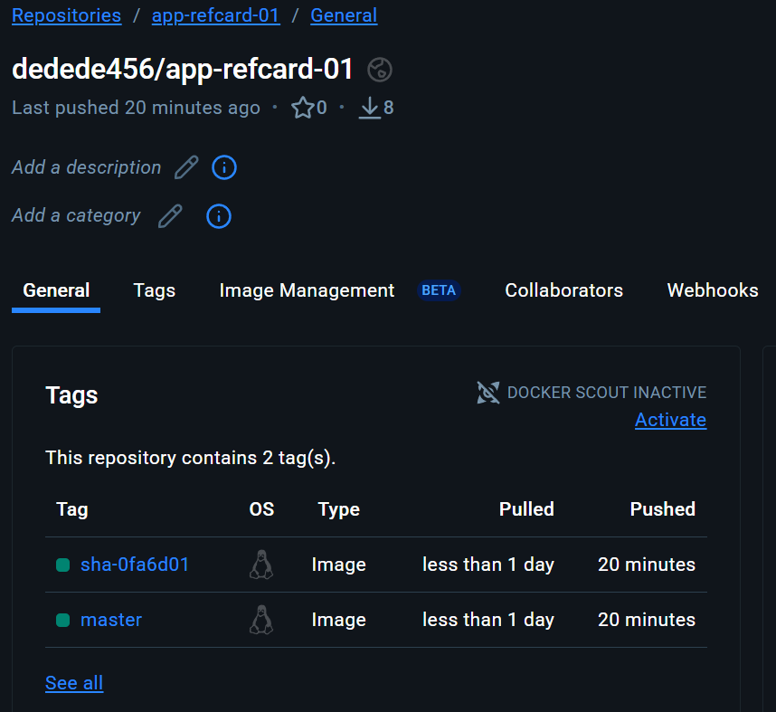

# App Ref. Card 01
Standalone Spring Boot Application

---
title: App Ref. Card 01
author: Caroline Simon, BBW
date: 03. November 2025
---


Link zur Übersicht:<br/>
https://gitlab.com/bbwrl/m347-ref-card-overview


## Installation der benötigten Werkzeuge

Maven Tutorial for Beginners<br/>
https://www.simplilearn.com/tutorials/maven-tutorial


### Projekt bauen und starten
Die Ausführung der Befehle erfolgt im Projektordner
Builden mit Maven<br/>
```$ mvn package```

Das Projekt wird gebaut und die entsprechende Jar-Datei im Ordner Target erstellt (Artefakt).
Die erstellte Datei kann nun direkt mit Java gestartet werden.<br/>
```$ java -jar target/app-refcard-01-0.0.1-SNAPSHOT.jar```

Die App kann im Browser unter der URL http://localhost:8080 betrachtet werden.


### Github CI CD
Schritte: 
- Projekt als .zip heruntergeladen
- zip folder extrahiert
- als git repo initialisiert
- .github/workflow/main.yaml erstellt
- Workflow beispiel von https://bbw-it.github.io/324_main_rupe/12_CI-CD_Pipelines/12.3.2_GitHubCIMitDeploy/ und angepasst
- add remote repo, commit, push
- workflow wird auf github automatisch ausgeführt, kann im action tab des repositories überprüft werden
- Dockerfile erstellen und befüllen, um auf GHCR zu deployen
- main.yaml um deployment step erweitern (mit chatgpt.com erstellt)
- nach dem pushen überprüfen
  - ob der workflow korrekt durchgelaufen ist: https://github.com/cxs1mon/DevOps_RefCard01/actions
  - ob es korrekt deployed wurde: https://github.com/cxs1mon?tab=packages


### Dockerhub
Um das Projekt auf Dockerhub anstatt auf GHCR zu deployen, muss folgendes gemacht werden:
- 2 Secrets im Github Repository hinterlegen
  - DOCKERHUB_USERNAME: Username von Dockerhub
  - DOCKERHUB_TOCKEN: kann man auf Dockerhub unter account settings -> Personal Access Tokens erstellen
- .github/workflow/dockerhub-deploy.yaml erstellen
- main.yaml kopieren und anpassen oder komplettes beispiel von https://bbw-it.github.io/324_main_rupe/12_CI-CD_Pipelines/12.3.2_GitHubCIMitDeploy/ übernehmen
  - Anpassen: Teil nach "Log in to GHCR" mit Dockerhub Beispiel von https://bbw-it.github.io/324_main_rupe/12_CI-CD_Pipelines/12.3.2_GitHubCIMitDeploy/ ab "Log in to Docker Hub" ersetzen
- commit und push -> workflow wird automatisch ausgeführt und kann im action tab des repositories überprüft werden
- nach dem pushen überprüfen
  - ob der workflow korrekt durchgelaufen ist: https://github.com/cxs1mon/DevOps_RefCard01/actions
  - ob es korrekt deployed wurde: https://hub.docker.com/repository/docker/dedede456/app-refcard-01/general


